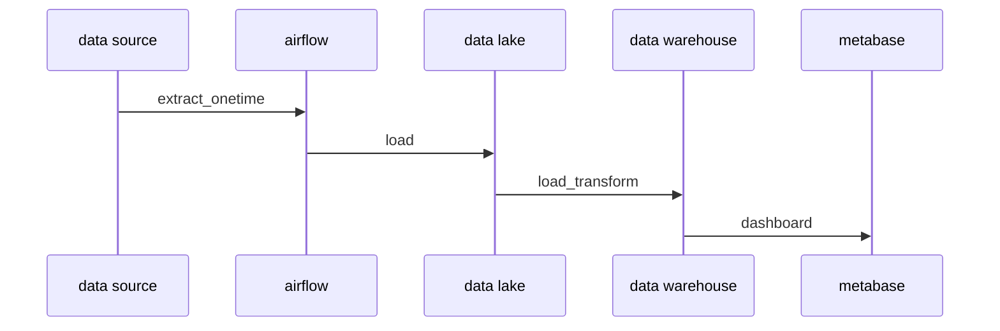

# Final Project Dphi Data Engineer Bootcamp
in this project the purpose is to create data pipeline. This project using docker and can be used in local/server but docker compose not yet ready in production.

## stack
- airflow       data pipeline 
- minio         data lake(object storage compatible with s3)
- postgres      data warehouse
- metabase      visualization tools

