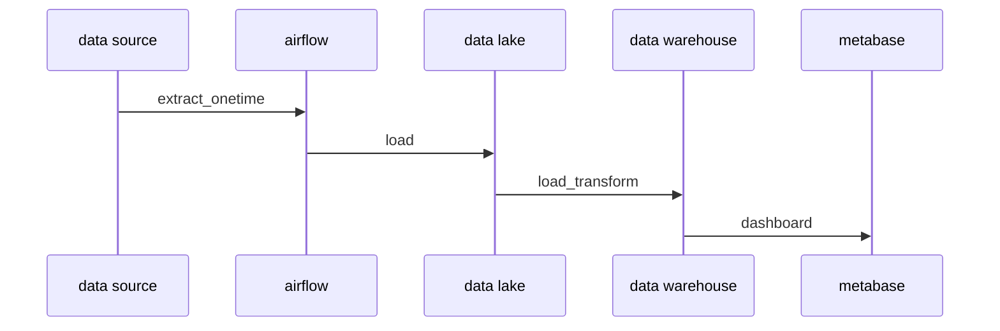

# Final Project Dphi Data Engineer Bootcamp
in this project the purpose is to create data pipeline. This project using docker and can be used in local/server. but docker compose isn't ready for production. you can check how to setup it for production by its coresponding website.

## note
1. use linux with docker engine and ram more than 8gb
2. don't use docker desktop, ram will not enough
3. if you have limited ram, you could stop some container while running some task
4. only tested in ubuntu

## stack
- airflow: data pipeline   
[airflow website](https://airflow.apache.org/)
- minio: data lake(object storage compatible with s3)  
[minio website](https://min.io/)
- postgres: data warehouse
- metabase: visualization tools  
[metabase website](https://www.metabase.com/)

## step to run this pipeline in local
1. create `.env` like `.env.example` change all {{}} into your own config   
2. in terminal run `docker compose --env-file ./.env up -d`  
3. setup your database connection in airflow with name `data-engineer-final-projects-data-lake-1` for minio/ any s3-like service [airflow s3 config](https://airflow.apache.org/docs/apache-airflow-providers-amazon/stable/connections/aws.html#configuring-the-connection) and `data-engineer-final-projects-postgres-1` for postgress
4. run dag with name `taskflow_api_etl`
5. if any of the task failed, please clear the failed task until all task success
6. after task finished you can start use the metabase to create dashboard

## result

## closing 
if any problem arise, you can contact me